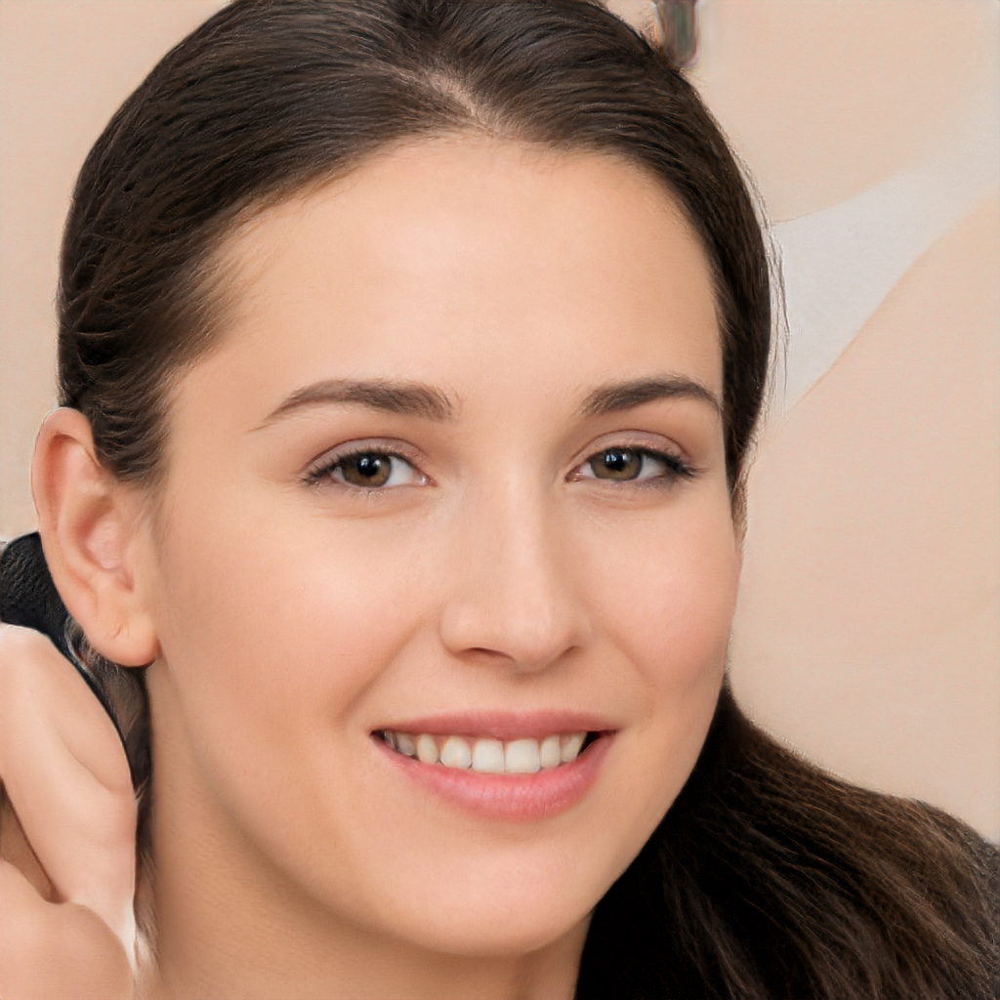
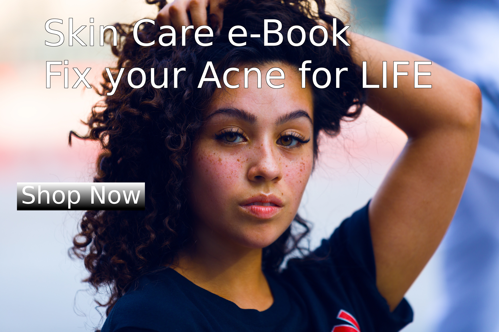

> I'm not a teenager anymore, why do I still have acne?!

# This is a question we hear from people on a daily basis. The truth is, it is quite common to see acne persist into adulthood. Although acne is commonly thought of as a problem of adolescence, it can occur in people of all ages. Adult acne has many similarities to adolescent acne with regard to both causes and treatments. There are some unique qualities to adult acne as well.

What causes adult acne? Adult acne, or post-adolescent acne, is acne that occurs after age 25. For the most part, the same factors that cause acne in adolescents are at play in adult acne. The four factors that directly contribute to acne are: excess oil production, pores becoming clogged by "Sticky" skin cells, bacteria, and inflammation. Including corticosteroids, anabolic steroids, and lithium, can also cause acne.

Many skin disorders, including acne, can be a window into a systemic condition. Hair loss, excess hair growth, irregular menstrual cycles, or rapid weight gain or loss in addition to acne, or rapid onset of acne with no prior history of acne, can all be red flags of an underlying disease, such as polycystic ovarian syndrome, or other endocrine disorders. Some acne spots are not actually acne but are post-inflammatory pigment changes from previous acne lesions or from picking at acne or pimples.

There is some evidence that specific dietary changes may help reduce the risk of acne. One meta-analysis of 14 observational studies that included nearly 80,000 children, adolescents, and young adults showed a link between dairy products and increased risk of acne. Some studies have linked high-glycemic-index foods and acne. Physicians seek scientifically sound and data-driven information; the evidence on the relationship between diet and acne is just starting to bloom. In the future, the effect of diet on acne may be better understood.

What are the most effective treatment options? The arsenal of treatment options for acne treatment is robust and depends on the type and severity of acne. Topical tretinoin, which works by turning over skin cells faster to prevent clogged pores, is a mainstay in any acne treatment regimen, and has the added bonus of treating fine wrinkles and evening and brightening skin tone. Isotretinoin, taken by mouth, is the closest thing to a "Cure" for acne that exists and is used to treat severe acne.

For women with hormonally driven acne that flares with the menstrual cycle, a medication called spironolactone, which keeps testosterone in check, can be prescribed. Oral birth control pills can also help regulate hormones that contribute to acne. Chemical peels, also done in-office, may help to treat acne and fade post-inflammatory pigment changes. Simple, non-irritating skin care products are important for anyone with acne. With proper evaluation by a board-certified dermatologist and commitment to a treatment regimen, almost all cases of acne can be successfully treated.
