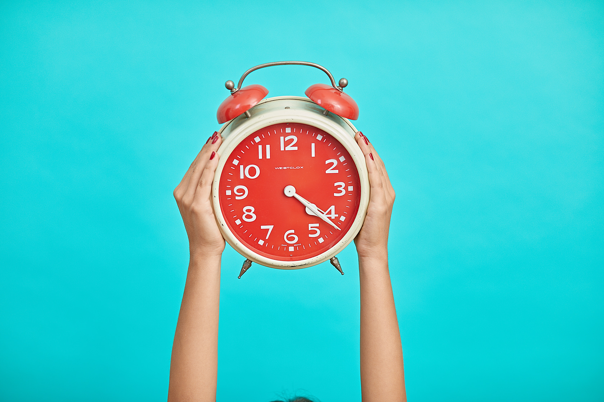

# Sleeping in late on a Saturday sounds delicious, right? However, as with many delicious things, there may be a cost to your health and waistline.

Catching up on sleep on the weekend can almost feel like the norm these days. With increasingly full schedules and competing demands, sleep is often sacrificed during the busy workweek. As the week comes to an end, many people look to the less structured weekend to cram in what couldn't be done during the week, including sleep.

When asked about their current sleep clinics, Harvard Clinicians said,
> I now ask "When do you get up on work days?" and "What about bedtime and wakeup time on days off?" The catch-up time - perhaps a 6 am wake-up for a work day, but 11 am on a weekend - can be close to an entire weeknight's sleep.

Does it matter? We're paying back our sleep debt, right? Our average hours of sleep may hide a weekly sleep debt Despite the fact that number of hours of sleep, when averaged, may approach the seven to nine hours per night recommended by most professional societies, the "Average" can hide some truths. The daily amount, quality, and regularity of bed/wake time all seem to matter too.

A recent paper in Current Biology shows that our sleep is not very forgiving of being moved around to more convenient times. Researchers found that subjects who cut their sleep down by five hours during the week, but made up for it on the weekend with extra sleep, still paid a cost. That cost included measurable differences: excess calorie intake after dinner, reduced energy expenditure, increased weight, and detrimental changes in how the body uses insulin.

Although sleep debt was resolved on paper, the weekend catch-up subjects had similar results to those who remained sleep-deprived across a weekend without catch-up sleep. New research is a reminder that you can't cheat on sleep and get away with it First, sleep deprivation, even if only during the workweek, likely has real health consequences. Sleep is often an overlooked factor when considering chronic disease risk, including hypertension, diabetes, heart disease, and even death.

There's ample data, including a recent review in Sleep Medicine, suggesting that too little sleep is a risk factor for these conditions, as well as obesity. This new study suggests that extending sleep on the weekend doesn't seem to undo the impact of short sleep. Second, whether the health impact is due to the decreased sleep alone, or additionally due to changes in timing of sleep on the weekend - an at-home "Jet lag" - is unknown. The impact of essentially jumping time zones by staying up later and sleeping later on weekends, may add to the problem. Other behaviors, such as eating or drinking later on weekends, also confuse the body's rhythm.

What can you do to improve nightly sleep? As with a lot of medicine, prevention seems to be the best strategy. Although we can't undo the impact of short sleep by trying to oversleep on the weekends, we can try to carve out a bit more time for sleep at night during the week and improve behaviors that lead to better sleep. It's very important to keep bedtime and waketime fairly stable across the weekend, which may also help reduce the jet-lag effect. Short naps of 15 to 20 minutes may help relieve sleepiness, but shouldn't interfere with the regularity of bedtime and waketime. For some people, keeping a sleep log to track sleep patterns can be eye-opening and provide accountability, in the same way that tracking food choices and behaviors around eating can help with weight loss.

Finally, consider reframing your relationship with sleep and prioritize it. Sleep is preventive medicine - we know it helps reduce illness and optimizes your daily well-being.